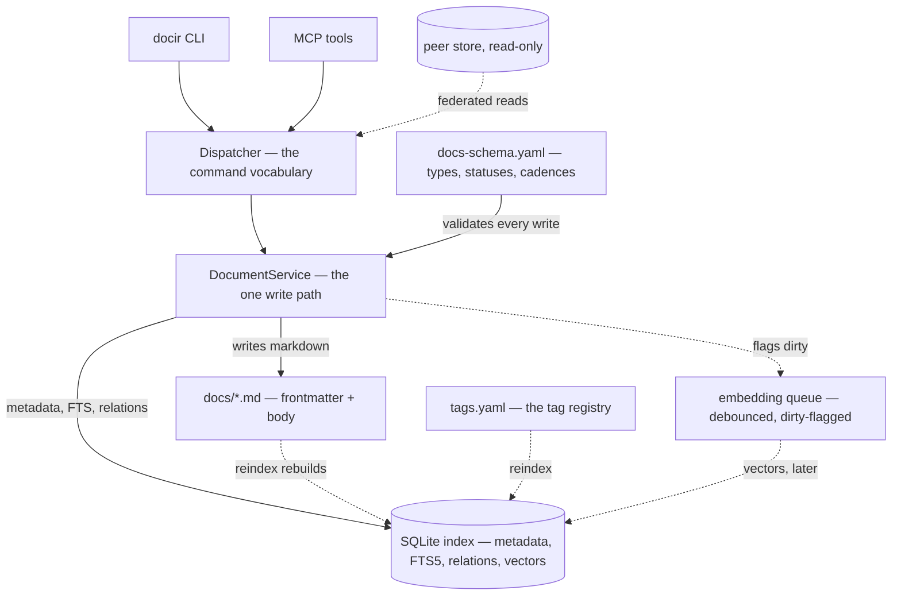

---
code:
- src/docir/**
created: '2026-07-30'
description: 'The design rationale: git as source of truth, the SQLite index as a
  derived projection — plus the daemon, the three validation tiers, chunked embeddings,
  schema drift, federation and publishing.'
id: arch-1cfb1b212237
owner: maintainer
related:
- adr-599055502f0e
status: active
tags:
- architecture
- persistence
- retrieval
title: Doc-Index CLI — Architecture
type: architecture
updated: '2026-08-15'
---

## Principle

Git is the source of truth. The database is a derived, read-optimized index
built on top of the markdown files. No data lives uniquely in the database —
it can always be rebuilt from the files. AI agents never edit markdown files
directly; all writes go through the CLI to guarantee schema consistency.

## Diagram

The thesis in one picture: the files are the source, everything below them is a
compile artifact, and there is exactly one path that writes markdown.



Solid edges are synchronous and current when the command returns. Dashed edges are
the deferred or derived ones: a reindex makes the index agree with the files, the
embedding queue catches up afterwards, and a peer store is read but never written.

## Layers and responsibilities

| Layer | Responsible for | Not responsible for |
|---|---|---|
| Files (.md) | Content storage, git history, human readability | Fast search, structured queries |
| SQLite index | Search, filtering, relation graph, embeddings | Storing unique data |
| Daemon | Warm embedding model, async embed queue, request serialization | Being user-visible; holding canonical data |
| CLI | Agent contract, single write path, frontmatter consistency | Project business logic |

## Daemon process

The CLI remains a thin, stateless client from the user's/agent's perspective
(`docir <command> ...`), but underneath it delegates to a long-lived local
background worker instead of doing heavy work cold on every invocation.

**Why:** the dominant cost of adding a semantic layer is not the embedding
computation itself but reloading the ONNX model into memory on every process
start — hundreds of milliseconds to over a second per call if done cold. A
persistent process keeps the model warm and serializes writes.

**Lifecycle:**

1. On first invocation of any command, the CLI checks for a running daemon: a
   pid file under `DOCIR_HOME` and a Unix socket. The socket is **not** under
   the home — a deep home path would blow past the platform's ~104-character
   `AF_UNIX` limit — so it is `<tmpdir>/docir-<sha1(home)[:12]>.sock`, short
   and stable per installation.
2. If not running, the CLI spawns it as a detached `python -m docir daemon
   serve`, waits for the socket, then proceeds. That entry point must keep
   working: it is how every cold start recovers.
3. Subsequent commands connect to the existing socket — no spawn, no model
   reload.
4. The daemon owns the SQLite connection and the loaded embedding model.
   Requests are serialized through one `SerializingExecutor`, which resolves
   write races without file locking.
5. The daemon is disposable: killed, missing, or answering on a stale socket,
   the CLI transparently respawns it. No command hard-fails because the daemon
   was not up.
6. An idle timeout (`DOCIR_IDLE_TIMEOUT`, 900s) keeps it from lingering as a
   forgotten background process.

**It also watches `docs/`.** Hand-editing a file is permitted, and the window
between an edit and a `docir reindex` was one where every read answered from a
stale index with nothing saying so. Automating it is safe only because the files
are canonical: reindex writes no markdown, so it can only make the index agree
with them — which is why it defaults on (`DOCIR_WATCH=0` opts out) rather than
being a flag. Two details are easy to undo by accident. The watcher and the
socket server share **one** executor, because the server serializes clients but
the watcher is a second writer and SQLite has one. And the watcher swallows
reindex failures on purpose: a half-written file is normal (editors save in two
steps) and the next batch fixes it, while an exception would end the thread
silently, leaving a daemon that looks healthy and has stopped watching.

**A daemon that does not match the installed code is replaced.** It loads docir
once and lives on, so after an upgrade or an edit under `src/` it kept answering
from the old build — and a stale answer imitates a correct one. The pid file
records a stamp of the version plus the newest mtime across the package, and a
mismatch stops and respawns. The stamp a running daemon reports is the one it
*started with*, not what is on disk now.

**Reaching the socket and waiting for the reply are timed separately**, and only
one is retryable. The connect is bounded at 5s, because a local `AF_UNIX`
connect succeeds at once or not at all; the reply is bounded by
`DOCIR_REQUEST_TIMEOUT` (300s), because it only arrives after the work is done
and one request can be a whole reindex. One shared timeout meant every command
slower than 5s failed while the daemon completed it. The two failures are
different exceptions on purpose: a refused connect means the request never
landed, so it is respawned and resent; an unanswered reply is **never** resent,
because the daemon still has it — a blanket retry killed it mid-transaction and
ran the command twice, which for a create meant a second document.

This keeps the "just run `docir ...`" UX simple — the daemon is an
implementation detail, never something to manage manually (though `docir daemon
status` / `docir daemon stop` are useful escape hatches), and `docir
--no-daemon` runs any command in-process.

## File format

```yaml
---
id: adr-3f9a2b1c7d4e            # `random` id_style; `sequential` mints adr-0007
title: Auth strategy
description: How the service authenticates API clients and refreshes tokens.
type: decision
status: accepted
tags: [auth, api]
related:                          # typed edges: bare id = relates_to
  - adr-0003
  - to: adr-0001
    kind: supersedes
created: 2026-06-15
updated: 2026-06-30
owner: platform-team             # optional: staleness steward
verified: 2026-06-30             # optional: last human re-confirmation
code:                            # optional: the code this document governs
  - src/auth/**
  - tests/test_auth.py
---
```
Body: standard markdown, human-readable, diffs cleanly in git.

### Frontmatter fields

| Field | Required | Set by | Description |
|---|---|---|---|
| `id` | yes | `docir add` (auto-generated) | `<type-prefix>-<suffix>`, never chosen manually. The suffix depends on the type's `id_style`: `random` (`adr-3f9a2b1c7d4e`) is what `docir init` writes by default, because two branches of one repo each have their own index and would otherwise both mint `adr-0007`; `sequential` (`adr-0007`) is opt-in via `docir init --id-style sequential` for readable numbers within a single store. `--id` adopts an existing id, for migrating a corpus whose numbers are already cited |
| `title` | yes | `docir add`, `docir update --set-title` | Canonical document title. Frontmatter-only source of truth; the CLI never enforces or generates a body heading from it |
| `description` | yes | `docir add`, `docir update --set-description` | One- or two-sentence summary of the document, written by the agent at creation and kept current on meaningful edits. Feeds search quality — indexed in FTS and included in the embedded text — and shown in `docir query`/`docir context` result listings so the agent can judge relevance without fetching the full body |
| `type` | yes | `docir add` (fixed at creation) | Document type (`decision`, `issue`, `architecture`, ...); selects the grammar that applies. That grammar is **not** only `docs-schema.yaml`: the frozen core and the named profiles are merged in from the installed package on every command, so an upgrade can change a type's rules with nothing in `git diff` — see "Schema drift and the index build stamp" |
| `status` | yes | `docir add` (default), `docir update --status` | Type-specific enum (e.g. `decision`: proposed/accepted/rejected/superseded; `issue`: open/resolved). Transitions are validated against `docs-schema.yaml` |
| `tags` | no | `docir add --tags`, `docir update --set-tags` | List of tag keys for `docir query --tag` filtering. Each key must exist in the tag registry (Tier 0 validation) — free-form tags are rejected, preventing synonym sprawl |
| `related` | no | `docir add --related`, `docir update` | List of **typed edges** to other documents (`<id>` = default `relates_to`, or `{to, kind}`); forms the relation graph used for traversal and Tier 1 graph checks. Kinds come from the schema's `relation_types` registry (unknown kind = Tier 0 error); a type may whitelist kinds/targets via `allowed_relations` |
| `created` | yes | `docir add` (auto) | Set once, never modified afterward; used for audit/sort queries |
| `updated` | yes | `docir add` / `update` / `archive` / `unarchive` | Stamped whenever one of those calls actually changes something. Deliberately **not** advanced by the mechanical rewrites — `check --fix`, the unlinking half of `delete --force`, and `tag rename` / `tag rm --force` — because staleness falls back to `updated` when there is no `verified`, so a mechanical bump would launder the review clock. `TagService` has no `Clock` for exactly this reason |
| `owner` | no | `docir add --owner`, `docir update --set-owner` | Optional steward, surfaced by the staleness check; written only when set |
| `verified` | no | `docir update --verified` | Optional date a human last re-confirmed the doc is still correct; resets the staleness clock (staleness measures from `verified`, else `updated`) |
| `code` | no | `docir add --code`, `docir update --set-code` | Repo-relative globs naming the code this document governs, so a later session can ask `docir query --code <path>` which decisions concern the files it is about to change. Only the *shape* is validated on write — absolute paths, `..` segments, backslash separators and empty entries are refused, but a pattern matching nothing today is accepted, because a decision is routinely written before the code it decides. `docir check` reports `unmatched-code` once a pattern stops matching, and only when the store sits in a repository. The index returns them sorted; the file keeps the author's order |
| `archived` | no | `docir archive` / `docir unarchive` | Absent by default; `true` removes the document from active search (FTS, embeddings) while keeping the file and index rows |

`created` is set once by `docir add` and never modified afterward. `updated`
is refreshed by the CLI on every `docir update` call (metadata or body). The
distinction matters for Tier 1 checks (e.g. a recently created orphan doc
vs. a long-standing one are different signals) and for audit queries like
"decisions made last quarter", which should sort on `created` rather than
`updated`.

`title` is stored only in frontmatter — it is the canonical source used by
the index for listings, `docir query`, and `docir context` results. The CLI
does not enforce or auto-generate any heading in the body; the agent
decides what (if anything) to write there, including whether to repeat the
title as an `# H1`.

`archived` is an optional frontmatter field, absent by default and set to
`true` only by `docir archive` (removed again by `docir unarchive`) — see
"Archiving vs. deletion" below.

### Tag registry

Tags are not free-form strings — they are registered entities, each with a
unique key and a description. The registry is the source of truth for what
tags exist, versioned in git like everything else (a `docs/tags.yaml`
mapping key → description; promotable to a full tag doc-type later if tags
need their own relations/history).

```yaml

# docs/tags.yaml
auth:    "Authentication, authorization, tokens, sessions."
api:     "Public/internal HTTP API surface and versioning."
storage: "Persistence, database schema, migrations."
```

- **Referential integrity (Tier 0):** every key in a document's `tags`
  must exist in the registry. An unknown tag is a hard error at
  `docir add`/`docir update` time — "unknown tag, register it first" — the
  same guarantee applied to `related` ids. This eliminates the main
  failure mode of free-form tags: synonym sprawl (`auth`,
  `authentication`, `Auth`) fragmenting the same concept.
- **Descriptions feed search:** a tag's description is available to
  `docir context` so the agent (and the semantic layer) can reason about
  what a tag means, not just match the bare key.
- **CLI:** `docir tag add <key> --description "..."`, `docir tag list`,
  `docir tag rename <old> <new>` (rewrites the key across all referencing
  documents), `docir tag rm <key>` (blocked while any document still uses
  it, unless `--force`). Unlike a dangling `related` id, a `--force` tag
  removal does not leave broken keys behind: since a tag is a classifier
  rather than a link, the CLI strips the removed key from the `tags` list
  of every referencing document (rewriting those files and reindexing
  them) as part of the same operation.

## Write path

Agent → `docir update` / `docir add` → CLI validates schema → writes to the
.md file → CLI updates that single file's index rows (metadata, FTS5,
relations) synchronously in the same command call, and schedules the
embedding recompute asynchronously (see Semantic layer). Everything except
the embedding is current the moment the command returns; the embedding
follows within seconds.

### Document creation (`docir add`)

```
docs add --type decision --title "Refresh token rotation" \
  --description "When and how refresh tokens are rotated on renewal." \
  --tags auth,api --related adr-0007 \
  --body-file draft.md
```

Steps performed by the CLI:

1. Generate `id` from the type's prefix and its `id_style`. A `random` type mints a
   collision-resistant suffix and retries if the index already holds it; a `sequential`
   type draws the next number from the database counter (`id_sequences`) in **one**
   atomic upsert — not by scanning files, and not by a read-modify-write in Python,
   which let concurrent `--no-daemon` processes all read the same value.
2. Assemble frontmatter from arguments plus type defaults (e.g.
   `status: proposed` for `decision`, `status: open` for `issue`) and
   auto-set `created` and `updated` to today.
3. Validate: required fields per type (including `title` and
   `description`, which the agent must supply at creation), `status` must
   be a valid enum value for that type, every id in `related` must already
   exist in the index.
4. Accept the body via `--body-file`, `--body "text"` for short content,
   or `--stdin` — the most agent-friendly option, avoiding shell-escaping
   issues with multi-line markdown.
5. Write the physical file to `docs/<type>s/<id>-<slug>.md`.
6. Synchronously index it: `INSERT` into `docs`, `relations`, and FTS5,
   and flag the row for embedding (computed asynchronously — see Semantic
   layer).
7. Return the generated `id` and file path to the caller, so the agent can
   reference the new document later in the same session.

### Document editing (`docir update`)

Two distinct operations, kept separate rather than merged into one:

- **Metadata update** (frequent, low-risk):
  `docir update issue-12 --status resolved` — patches only specific
  frontmatter fields, body untouched. `--set-title "..."` /
  `--set-description "..."` update those fields the same way.
- **Body update** (higher-risk) — three supported modes:
  - `--append-section "Resolution" --body "Fixed in PR #42"` — appends a
    new heading/section at the end without touching existing content.
    **Default, safest path** — fits patterns like "issue closed → note how".
  - `--replace-section "<heading>" --body "..."` — replaces content under
    a specific existing heading.
  - `--replace-body --force` — full body replacement. Requires an explicit
    force flag because it can silently overwrite content the agent never
    read in full; agents should `docir get` first.

When a body edit changes what the document is fundamentally about, the
agent is expected to update `description` in the same call (e.g.
`--append-section ... --set-description "..."`), keeping the summary
that drives search in step with the content — the same discipline applied
to `title`.

### Write conflict handling

`update` compares the `content_hash` the index holds against the file's and calls
the result `disk_diverged`. It is consulted in **one** branch, and that scoping is
the rule rather than an oversight.

Every edit is applied to the document *as it is on disk*: the command re-reads the
file, then stages the change onto that. So `--append-section`, `--replace-section`
and any metadata patch **compose** with an out-of-band change and cannot destroy
it — there is no merge algorithm to get wrong, because there is nothing to merge.
`--replace-body` is the only mode that discards the on-disk body, so it is the
only one where divergence means data loss, and the only one that refuses:

```
docir update <id> --replace-body --force --body "..."
  -> error: <id> changed on disk since it was indexed; refetch with docir get <id>
```

It also requires `--force` independently, because overwriting a whole body is worth
one deliberate keystroke even when nothing diverged.

Extending the guard to the other modes would fail writes that lose nothing —
`--set-title` refusing because someone fixed a typo by hand. `TestDiskDivergenceScoping`
pins that.

**It is a divergence check, not optimistic concurrency control.** No caller supplies
a version token, so it cannot see a competing *writer*, only a file that changed
since it was indexed. The daemon serializes requests, which is what makes that
adequate in practice; `docir --no-daemon` parallel writers have a small unguarded
window.

The variable is `disk_diverged`, not `stale`. In this codebase `stale` means a
document past its review cadence — a different concept on a different clock.

### Per-type schema

Required fields, valid status enums, and allowed status transitions (e.g.
`open → resolved`, not the reverse without an explicit override) are
defined in a `docs-schema.yaml` config, not hardcoded in the CLI — new
document types can be added without changing CLI code. A type also declares its
`review_days` staleness cadence and, optionally, `allowed_relations`
(`{kind: [target types]}`) constraining which typed edges it may declare. The
valid relation kinds are a top-level `relation_types` registry (permissive when
absent, for schemas predating typed edges).

**Core + profiles.** The schema is composed, not monolithic: a frozen
domain-agnostic **core** (the `decision` type, the relation registry, cadences)
plus named **profiles** that layer domain types — `software`
(issue/architecture/release_note), `research`, `ops`, `qa` (test_plan/test_case),
`legal`. A `docs-schema.yaml` selects them with `profiles: [..]`; the loader
merges `core → profiles → the file's inline overrides`. The default is
`profiles: [software]`. This keeps generalizing docir to a new domain a matter of
picking a profile rather than mutating the base schema. Because the merged result
— not the file — is what validation enforces, `docir schema show` prints it and
`docir schema validate` checks an edit; both run in-process, since a schema too
broken to build the container is exactly when they are needed. See
adr-599055502f0e/0006/0007/0010 for typed edges, staleness, profiles, and schema
introspection respectively.

## Read path

Agent → `docir context "<task>"` → hybrid scoring (FTS5 + semantic) +
related-graph traversal → returns a small relevant subset instead of the
whole `docs/` folder.

**Two-tier retrieval (skeleton → body).** `context`, `query`, and `search`
return *skeletons* — frontmatter, tags, typed `related`, and the
`owner`/`verified`/`stale` fields, but **not the body**. The agent scans those to
judge relevance and then fetches only the bodies it needs with `docir get <id>`.
Keeping bodies out of result sets is where the context savings come from; the
`description` field (indexed and shown in listings) is what makes the skeleton
enough to judge relevance.

### Semantic layer (fastembed)

Pure FTS5 misses semantically close but lexically different matches (e.g.
a query about "refresh token handling" against a document titled "session
renewal strategy"). `fastembed` (ONNX-based, quantized, CPU-only, no
external API call — consistent with the project's privacy-first stance
elsewhere) closes this gap without pulling in heavy ML dependencies.

- **Storage:** a document vector over `title` + `description` + body,
  **plus one vector per `##` section** — see "Semantic index: every section
  is embedded" below for why the document vector alone was not enough. Both
  are BLOBs in SQLite; each row records the model that produced it, so
  switching embedder recomputes rather than comparing vectors of different
  widths. The agent-authored `description` gives the document vector a
  concise, high-signal summary to anchor on, improving retrieval over
  embedding raw body text alone. Brute-force cosine similarity is sufficient
  at this scale (hundreds to low thousands of documents) — no ANN index
  needed.
- **`docir context` scoring:** combines FTS5 BM25 score and cosine
  similarity (e.g. weighted sum or reciprocal rank fusion) rather than
  replacing FTS5 outright — lexical matches are still valuable and cheap.
- **Where it runs:** entirely inside the daemon (see above), so the model
  is loaded once and reused; per-call added latency is on the order of
  single-digit to tens of milliseconds, not the cold-start cost of loading
  the model fresh.
- **Recompute triggers:** the embedding is tied to *what changed*, not to
  every `docir update` call — recomputing on metadata-only changes (e.g. a
  status transition) would be wasted work with no benefit:
  - `docir add` → embedding scheduled (new document).
  - `docir update` changing `title`, `description`, or the body
    (`--append-section`, `--replace-section`, `--replace-body`) →
    embedding scheduled.
  - `docir update` touching only other frontmatter fields (`--status`,
    `--tags`, `related`) → embedding left untouched.
  - `docir archive` / deletion → the vector is removed from the index along
    with its FTS and relation rows, so an archived/deleted document can't
    resurface via similarity search or Tier 2 DRY checks.

- **Async recompute (not on the write's critical path):** an agent rarely
  writes a document in a single call — it does `docir add` then several
  `--append-section` edits over a long session. Recomputing the vector
  synchronously on each write would re-embed the same document repeatedly
  and put model inference on the write path, serializing the agent's rapid
  successive calls behind it. Instead, two levels of consistency are
  separated:
  - **Synchronous, immediately consistent:** file write, metadata, FTS5,
    relations. Cheap, and search correctness depends on it — ready by the
    time the command returns.
  - **Deferred, eventually consistent (embeddings only):** a content
    change sets an `embedding_dirty` flag on the row (persisted in SQLite,
    so it survives a daemon crash/restart) and returns immediately. A
    background worker inside the daemon drains dirty rows with a short
    **debounce** window (a few seconds), coalescing a burst of edits to
    one document into a single recompute.

- **Consistency window:** between the write and the vector being ready, the
  document is still found via FTS (lexically) — the semantic contribution
  simply joins a few seconds later. A brand-new document is FTS-only until
  its vector lands; an updated one temporarily keeps its previous vector.
  On daemon restart, the worker re-embeds anything still flagged dirty, so
  nothing is silently lost.

- **Escape hatch:** `--wait-embeddings` on a write, or `docir embed --flush`,
  forces a synchronous recompute when a semantically-heavy query must run
  immediately afterward (e.g. in tests).
- **Model version changes:** if the embedding model is upgraded, existing
  vectors become stale; `docir reindex --embeddings` recomputes them all,
  same fallback pattern as the existing `docir reindex`.
- **Also powers Tier 2 DRY linting** (`docir lint --deep`): the same
  vectors are reused to flag content-similarity across documents, so
  there's no duplicate infrastructure for search vs. lint.

## Semantic index: every section is embedded

The embedding model (`bge-small-en-v1.5`) reads about 512 tokens — roughly
1,900 characters of prose — and silently ignores the rest: appending text past
that boundary returns a bit-identical vector. 84 of docir's own 103 documents at
the time of measurement exceeded it, so more than half the corpus was absent
from the semantic index while FTS5 hid the problem by covering the whole body.

So the embedding pass writes a document vector **and one vector per `##`
section** (`chunk_embeddings`, keyed `(doc_id, ordinal)`). The scorer accepts
repeated ids from the semantic ranking and keeps each document's **best**
chunk — RRF fuses rankings *of documents*, so the collapse has to happen before
fusion, not after. The winning candidate survives the collapse, not just its
score, which is what lets a ranked hit name the heading that matched
(`matched_section`) and an agent read only that span with
`docir get <id> --section "<heading>"`.

Load-bearing details:

- `MAX_CHUNK_CHARS` (1200) is *derived* from the measured window, not chosen —
  and each chunk carries the document title as a prefix, which eats into the
  budget. A chunk allowed to overflow reintroduces the original bug one level
  down.
- The splitter tracks fenced code blocks, because a `##` comment inside one is
  not a heading, and cutting there yields two invalid chunks.
- There is **no second dirty flag**: chunks are rewritten wholesale under the
  existing `embeddings.dirty` queue, in the same transaction.
- Tier 2 similarity linting deliberately still compares *document* vectors only.
  Chunk vectors would answer "do these two share a section", not "are these the
  same document".
- `indexing` may not import `documents`, so the entity is the seam:
  `Document.embedding_chunks()` hands the scheduler positional
  `(ordinal, heading, text)` triples.

Because max-pooling structurally favours documents with more sections, the
recall gate on the benchmark corpus is not optional — keep it when touching
ranking.

## Index consistency

The index update is not tied to git at all — it happens synchronously inside
`docir update` / `docir add`, as part of the same operation (the embedding is the
one deferred piece — see the semantic sections above — but metadata, FTS5 and
relations are immediate). Git commits are just a snapshotting mechanism on top of
files that are already consistent with the index.

`docir reindex [--changed]` rebuilds the index from the canonical files. It is no
longer only a manual fallback: the daemon watches `docs/` and runs it on what
changes, so a hand-edited file is picked up without anyone remembering to. Run it
by hand after a merge, a pull or a fresh clone — the index is gitignored, so a
clone has none — and to recover from corruption.

Three things about it are load-bearing:

- **`--changed` is not a different result, only less work.** It skips re-saving
  files whose content is unchanged. The removal sweep runs in **both** modes: it
  used to be skipped under `--changed`, which gave the fast path quietly
  different semantics — a document deleted from the filesystem stayed in the
  index and kept being returned by every read path.
- **Read `documents_skipped`.** A source file whose frontmatter will not parse is
  skipped, not indexed: it exists on disk and is invisible to every read path. A
  rebuild that quietly dropped a document used to look exactly like one that did
  not. Non-zero means run `docir check`, which names each file.
- **It restores derived state the files do not carry.** The id counter is raised
  to the highest suffix on disk, and the schema baseline and the version stamp
  are rewritten — `reindex` is the only writer of all three, because it is the
  verb that already means "make the derived state agree with the sources".

## Status filtering (default visibility)

Closed documents are not deleted or hidden physically — they stay in `docs/`, in
git history, and remain fully queryable. Visibility is controlled purely at the
read path:

- `docir context`, `docir query` and `docir search` filter to active statuses by
  default. "Closed" is per type, not one hardcoded status: each type declares
  its own `inactive_statuses` — `superseded`/`rejected` for a decision,
  `resolved` for an issue, `deprecated` for architecture.
- `--include-inactive` widens any of them, and `docir get <id>` always returns
  the document whatever its status — an agent checking whether a similar bug was
  already fixed needs exactly that. (`--include-resolved` is the old spelling,
  still accepted; it named a status only two types have.)
- `docir archive` goes further, removing a document from active search entirely
  (see "Archiving vs. deletion") — for volume rather than for status.

**There is exactly one visibility predicate, and expansion runs both ways.**
`DocumentService._is_visible` (archived + inactive status) is called by the
ranked fusion loop *and* by the graph-expansion pass; do not inline the check
into either. They used to differ — expansion tested only `archived` — so a
resolved issue the caller had excluded came back through a neighbour edge, and
the filter that held on three read paths leaked on the fourth.

Expansion follows outgoing edges **and** incoming *successor* edges, successors
first in each seed's list. A `supersedes` edge points from the new document to
the old one, so before this the replacement sat one hop away *backwards* and the
graph could not answer "is this decision still current?" — the question it exists
for. Which kinds count is schema data (`successor: true`), not a hardcoded pair,
so a custom kind with that shape is followed too.

Down-weighting closed documents in scoring instead of excluding them was
considered and not built: a status filter is a statement about whether a document
is current, and a score is a statement about relevance. Blending them makes
neither answerable.

## Archiving vs. deletion

Two distinct operations with different reversibility, since an archive-only policy
would let the archive grow unbounded forever:

- **`docir archive <id>`** — soft, reversible. Sets `archived: true` in the
  document's own frontmatter (the file is the source of truth, same as `status`)
  and removes it from active search surfaces (FTS5, embeddings) in the index.
  `docir unarchive <id>` removes the field again. Because the flag lives in the
  file itself, a full `docir reindex` from a fresh clone correctly keeps archived
  documents out of active search without any side-channel state.
- **`docir delete <id>`** — hard, irreversible within the tool itself. Deletes the
  physical file and all its rows (metadata, FTS, embeddings, chunks, relations).
  Since git still holds the file's history this is not true data loss — consistent
  with "git is the source of truth, the index is derived". Used sparingly.

**Referential integrity on delete.** If other documents link to the id, `docir
delete` fails by default (Tier 0 style) rather than silently leaving a dangling
reference, and names the referrers.

`--force` deletes anyway, and **compensates for the edges it breaks**: it strips
the edge from every referencing document in the same transaction and returns their
ids, which the CLI prints as "unlinked from ...". So a forced delete cannot leave a
dangling reference — the pattern `tag rm --force` already used for tags.

That is not a nicety. `dangling` is an **error**-severity Tier 1 finding, not a
warning: it means the corpus is broken and `docir check --strict` fails on it. And
because Tier 0 only validates the edges supplied in the *current* call, a
referencing document left holding a dead id would re-persist it to the canonical
file on its next unrelated `update`. Detect-only was a state the product could
notice and not exit.

The compensating write deliberately does **not** advance the referrers' `updated`.
It follows `check --fix`, not a human edit: staleness records when someone last
vouched for the content, and having a link removed from underneath you is not
that.

One consequence for the test suite: `delete --force` can no longer manufacture a
dangling edge, so the fixture that needs one builds it the way it really arises —
remove the target's file as a merge would, then `docir reindex`.

## Validation strictness tiers

The system borrows the "programming language" metaphor (schema = grammar, typed
`related` links = imports, validation = compiler, graph checks = linter) but only
where it holds: document metadata and the relation graph are formally checkable,
document *body text* is natural language and is not — so checks are split into
three tiers, not one uniform gate. Mixing these levels (hard-failing on a
text-similarity heuristic, say) is the main overengineering risk and is
deliberately avoided.

### Tier 0 — hard errors (synchronous, blocks the write)

Runs inline inside every `docir add` / `docir update` call, like a compiler. Only
checks that are cheap and essentially free of false positives:

- Missing required frontmatter field for the document's type
- Invalid `status` value (not in the type's enum)
- Invalid status transition (`--override` forces one and warns, naming the rule
  it broke; it cannot set a status the type does not declare)
- A `related` id that does not exist in the index
- A relation `kind` not in the `relation_types` registry, or one the source
  type's `allowed_relations` whitelist forbids for that target type
- A `tags` key not in the tag registry
- A `code` glob that can never match — absolute, containing `..`, backslash
  separated, or empty. A pattern that matches *nothing today* is accepted: a
  decision is routinely written before the code it decides
- Malformed frontmatter (not valid YAML, wrong types)

### Tier 1 — structural findings (non-blocking, via `docir check`)

Graph-level issues, run on demand or in CI, never inline in an agent's write
call — an agent mid-task should not be blocked by a "possible problem".

**Findings carry a severity, and this is the load-bearing part.** `ERROR_KINDS`
is `duplicate-id` / `dangling` / `malformed`: the corpus is *broken*. Everything
else is a `warning` about shape or age. `docir check --strict` exits 1 on errors
only and is the pre-merge gate; `--strict-all` makes every finding fatal for
anyone who wants that.

The distinction is not cosmetic. `orphan` fires for every document with no
relations — the default state of a new one — so a fail-on-any-finding gate went
red on a healthy corpus, and the only way to keep CI green was to drop the gate,
which also dropped the duplicate-id detection that was its actual purpose.
`CheckIssue` derives `severity` from `kind`, so a new check classifies itself by
being added to `ERROR_KINDS` or not.

| kind | severity | means |
|---|---|---|
| `duplicate-id` | error | two files claim one id; the index dedupes, so one document is invisible. Found by scanning the *files*, not the index |
| `dangling` | error | a `related` edge points at nothing |
| `malformed` | error | a file the loader cannot parse — absent from every read path |
| `orphan` | warning | no relations either way |
| `cycle` | warning | a loop in the graph |
| `layering` | warning | a higher-level type *depends on* a lower one |
| `stale` | warning | past the type's `review_days`, measured from `verified` else `updated` |
| `unmatched-code` | warning | a `code` glob that no longer names anything (only when the store sits in a repository) |
| `unknown-type` / `unknown-status` / `unknown-tag` / `unknown-relation-kind` | warning | the file was written outside the CLI, or a profile was disabled under it |
| `missing-required` | warning | the *rule* moved under a document that was valid when written |
| `schema-drift` | warning | the resolved schema differs from the one the index was built against |
| `stale-index-build` | warning | a different docir built this index |
| `tag-key-format` | warning | a registry key that is not a usable tag |

The last group must not be promoted to errors: the schema they measure against
ships in the *package*, so a corpus that passed yesterday can fail today with no
commit to point at, and nothing about the documents changed.

**Layering is opt-in per relation kind.** The check reads only edges the schema
marks `dependency: true` — `depends_on` and `refines` among the core six. It is
not a list of exempt kinds: `relates_to`, `implements` and `supersedes` are
simply not dependencies, so linking a decision to the issue that motivated it is
normal and silent. Treating every edge as a dependency made the most natural
pairing in the quickstart a permanent warning.

**`docir check --fix` repairs what needs no guess**: duplicate ids are re-issued
(the *oldest* file keeps the id, because existing edges were written against it
and an edge cannot say which document it meant) and dangling edges are dropped.
It reindexes first, and does **not** advance `updated` — a mechanical repair is
not a human re-verification. `malformed` and `unknown-type` are deliberately left
to a human and returned unrepaired: those need someone to decide what the file or
the schema should say.

### Tier 2 — advisory/style (opt-in only, via `docir lint --deep`)

Heuristic, never CI-blocking, run only when a human chooses to:

- Content similarity across documents (DRY at the idea level), using the
  *document* vectors already computed for `docir context` — surfaced as a
  suggestion, never an error. Chunk vectors are deliberately not used here: they
  would answer "do these share a section", not "are these the same document"
- Document size / scope creep (one document covering several unrelated decisions)

### Why this split

Tier 0 can be as strict as a real compiler because it is fully deterministic and
cheap to verify. Tiers 1–2 deal with things that are inherently uncertain (graph
shape, natural-language meaning), so they are surfaced as information, not
failures — keeping the CLI usable in an agent's task flow while still giving
humans and CI a way to keep the graph healthy. Never promote a heuristic to a
hard error.

## Schema drift and the index build stamp

The schema is not only `docs-schema.yaml`. The frozen core and the bundled
profiles are compiled into the package and re-merged on *every* command, so
upgrading docir can add a type, make a field `required:`, or change a prefix in
a store whose schema file nobody touched — with nothing in `git diff` to review.

The index therefore records two facts about how it was last built, each in its
own one-row table, and `docir reindex` is the only writer of both:

| Table | Records | Reported by `check` as |
|---|---|---|
| `schema_baseline` | the resolved schema the index was built against | `schema-drift`, one finding per change (`+type test_plan`, `type decision: required [] -> ['owner']`) |
| `index_build` | the docir version that built the index | `stale-index-build` |

They are separate on purpose. The baseline payload is diffed line by line and
printed, so a version key inside it would render every upgrade as a schema
change — and the baseline cannot answer the version question anyway, since it
compares schemas and stays silent for a release that changes how documents are
*read* rather than what they may say.

Three rules hold this up:

- **Absent means unknown, not unchanged.** A store with no baseline reports
  nothing, rather than reporting its entire schema as new; an unparseable one
  reads the same way, since `reindex` overwrites it. `stale-index-build`
  likewise fires on **inequality**, not "older than" — a downgrade needs the
  same rebuild.
- **`reindex` is the only writer.** It is already the "make derived state agree
  with the sources" verb. A separate `accept` command would be a ritual whose
  only effect is silencing a report.
- **One renderer.** The drift check lives in `application`, which may not import
  `infra`, so both sides go through `domain/services/schema_shape.describe`. A
  second renderer would mean a baseline written in one shape and compared in
  another.

`DOCIR_SCHEMA_NOTICE=1` prints the drift on stderr after every command. It is
emitted **client-side**, through the same request boundary, because with the
daemon running the process that first loads a changed schema is the daemon —
whose stderr is a log nobody reads. `docir self upgrade` is the command that
acts on `stale-index-build`: reindex → `agent update` → `check`, in that order.

## Reading across stores

In a multi-repo organisation the decision governing the service you are editing
often lives in the platform repo, and an agent reading `context` in the service
repo cannot see it — so it re-decides. `.docir/stores.yaml`, committed beside
`docs-schema.yaml`, declares peer store homes; `--store PATH` (repeatable) adds
one for a single invocation **on top of** that list, without editing the file.
Relative paths resolve against this store's home, so a file one person commits
works for everyone who clones the same layout, and the list is read per request
rather than cached at daemon startup.

**Reads federate; writes never do.** Exactly four commands fan out —
`get`, `query`, `search`, `context` — and that set is asserted against the
dispatcher's own command list in the suite, so a new command joins by decision
rather than by omission. Every write and every maintenance command runs against
the local store alone.

Three properties are load-bearing:

- **Peers are opened read-only at the database**
  (`sqlite:///file:<path>?mode=ro&uri=true`), so "docir does not write to a
  peer" is enforced by SQLite rather than promised by a comment. This is also
  why peers get their own construction path: the normal container build runs
  migrations and creates directories, both of which write.
- **An unreadable peer is skipped with a warning on stderr, never an error.** A
  peer's index is derived and gitignored, so a fresh clone of it simply has
  none; failing the read would make one repository's state everyone's outage.
- **The merge sorts on `similarity`, never `score`.** RRF ranks *within* one
  store, so comparing two stores' scores compares the sizes of their corpora.
  Rows carry a `store` field only while federating — it is pure cost with one
  store, which is why the read paths never carried it before.

## Publishing the corpus

`docir build --out site/` renders the whole store as a self-contained static
site — one HTML page per document plus an index, no external requests, so it
works from `file://` and publishes to GitHub Pages or S3 unchanged. It is what
turns the corpus into something reviewable by people who will never run the CLI.

The site is derived like the index, and is guarded accordingly: every `*.html`
in `--out` is removed before writing, so a document deleted from the store
cannot survive as an orphaned page nobody can reach and nobody knows is stale.
"Delete everything here first" has to be sure it owns "here" — a previous docir
build is recognised, and any other non-empty directory is refused unless
`--force`, because `--out` is a path a person types.

The build does one `query` and then one `get` per document. Bodies are absent
from every list path by contract, so a build that stopped at `query` would
report the right document count and publish empty pages — which looks exactly
like success.

Architecturally, `publishing` is a **leaf module**: it takes documents as data
(the `docir get` JSON shape) rather than importing `documents.api`. The site is
a projection of the public contract, not a second reader of the aggregate — do
not "simplify" it by handing it a `DocumentService`.

## CLI commands

Every command below exists in `docir --help`; the groups are `agent`, `daemon`,
`mcp`, `schema`, `self` and `tag`. Global flags come *before* the command
(`docir --pretty get <id>`): `--home`, `--store`, `--no-daemon`, `--json`,
`--pretty`, `--no-trim`.

**Read** — `query`/`search`/`context` return skeletons (no body); only `get` returns one.

| Command | Purpose |
|---|---|
| `docir get <id> [--section "<heading>"]` | One document in full, or just the span under one heading |
| `docir query --type decision --status accepted --tag auth` | Structured filtering; also `--owner`, `--stale`, `--code`, `--limit/--offset` |
| `docir search "<text>"` | Full-text over title, description and body |
| `docir context "<agent task>"` | Ranked minimal set (FTS5 + semantic, fused) plus graph neighbours; `--expand`, `--min-score` |

**Write** — the single sanctioned path to a markdown file.

| Command | Purpose |
|---|---|
| `docir add --type <t> --title "..." --description "..."` | Create a document with valid frontmatter; id allocated for you |
| `docir update <id> --status resolved` | Metadata patch and/or a body edit (`--append-section`, `--replace-section`, `--replace-body --force`) |
| `docir archive <id>` / `docir unarchive <id>` | Soft-remove/restore from active search, reversible |
| `docir delete <id> [--force]` | Hard-delete file + index rows; blocked by incoming `related` links unless forced, which unlinks them |
| `docir tag add <key> --description "..."` / `docir tag list` | Manage the tag registry |
| `docir tag rename <old> <new>` / `docir tag rm <key> [--force]` | Rename across every referencing document / remove it |

**Maintenance** — the derived index and the corpus's shape.

| Command | Purpose |
|---|---|
| `docir reindex [--changed] [--embeddings]` | Rebuild the index from the canonical files; read `documents_skipped` |
| `docir check [--strict] [--strict-all] [--fix]` | Tier 1 structural findings; `--strict` is the CI gate (errors only), `--fix` repairs what needs no guess |
| `docir lint --deep` | Tier 2 advisories (content similarity, scope creep) |
| `docir embed --flush` | Force a synchronous recompute of dirty vectors |
| `docir schema show` / `docir schema validate` | Inspect the merged schema / check `docs-schema.yaml` before a write reaches it |

**Bootstrap, serving and the installation itself.**

| Command | Purpose |
|---|---|
| `docir init [DIR] [--profiles ...]` | Create a project-local `.docir` store that commands discover by walking up |
| `docir build --out site/` | Render the corpus as a self-contained static site |
| `docir agent install` / `docir agent update` | Install or refresh AI-assistant instruction files |
| `docir daemon start` / `status` / `stop` | Escape hatches; the daemon is otherwise spawned and reaped for you |
| `docir mcp serve` | Expose the same vocabulary as MCP tools over the same dispatcher |
| `docir self status` / `docir self upgrade` | What is installed and whether it is current / upgrade and resync the store |
| `docir version` | Print the docir version |

---|---|
| `docir get <id>` | Return one document in full |
| `docir query --type decision --status accepted --tag auth` | Structured filtering |
| `docir search "<text>"` | Full-text search |
| `docir context "<agent task>"` | Ranked, minimal relevant document set |
| `docir update <id> --status resolved` | Update a document via CLI (writes file + indexes metadata/FTS/relations synchronously, embedding async) |
| `docir add` | Create a new document with valid frontmatter (writes file + indexes synchronously, embedding async) |
| `docir archive <id>` / `docir unarchive <id>` | Soft-remove/restore a document from active search, reversible |
| `docir delete <id> [--force]` | Hard-delete file + all index rows; blocked by incoming `related` links unless forced |
| `docir tag add <key> --description "..."` / `docir tag list` | Manage the tag registry |
| `docir tag rename <old> <new>` / `docir tag rm <key> [--force]` | Rename a tag across all documents / remove it (blocked while in use unless forced, which strips the key from referencing documents) |
| `docir reindex [--changed]` | Manual fallback: rebuild index after external/manual file edits |

---

## End-to-end business flow example

**Scenario:** an agent is asked to implement a new authentication endpoint.

1. **Discover context**
   Agent runs `docir context "implement new auth endpoint"`. The CLI ranks the
   corpus twice — FTS5 over the text and cosine over the vectors, per document
   *and* per section — fuses the two rankings, then expands one hop across the
   relation graph inside the same `--limit` budget. Expansion follows outgoing
   edges **and** incoming successor edges, so a decision that supersedes a hit
   arrives with it rather than sitting one hop away backwards.
   It returns a handful of documents instead of the whole store — as
   **skeletons**: frontmatter, typed edges, staleness, and no bodies. That is
   the contract that makes the step cheap.

2. **Read only what matters**
   Agent judges relevance from the skeletons — by `similarity`, the raw cosine,
   never by `score`, which is rank-derived and says nothing about how good a
   match was — then calls `docir get adr-3f9a2b1c7d4e` for the bodies it
   actually needs. If the hit named a `matched_section`, that heading goes
   straight to `docir get <id> --section "<heading>"` and the agent pays for one
   section instead of a body ten times its size.

3. **Check what the change is governed by**
   `docir query --code src/auth/login.py` answers the other direction: which
   documents declared they govern the files about to change. The patterns are
   matched as text, so a file the branch *deletes* still finds its decisions.

4. **Implement the feature** (outside the doc system).

5. **Record a new decision or open issue**
   If the implementation surfaces a new tradeoff:
   `docir add --type decision --title "Refresh token rotation" --description "..." --tags auth,api --related adr-3f9a2b1c7d4e --code "src/auth/**"`
   `auth` and `api` must already exist in the tag registry and the `--related`
   target must exist, or the call fails Tier 0. The CLI allocates the id from
   the index counter — never by scanning files, which is what keeps parallel
   agents from minting the same one — writes the file with valid frontmatter,
   and indexes it. The vector is queued, not computed: add `--wait-embeddings`
   if the next command must find it semantically.

6. **Update the status of the resolved issue**
   `docir update issue-7d1e4b9c02fa --status resolved`. The CLI validates the
   transition against the type's state machine, rewrites the frontmatter, and
   updates metadata, FTS and relations synchronously — the index is current when
   the command returns. A status-only change does not touch the embedding.

7. **Commit**
   Agent or human commits the changed `.md` files, purely as a history action.
   The index was already updated in steps 5–6 and does not depend on the commit;
   it is gitignored, and a fresh clone rebuilds it with `docir reindex`.

8. **Human review**
   A teammate reviews the diff as plain markdown — no database inspection — and
   traces the decision's history with `git log` on the file. For a reader who
   will not run the CLI, `docir build --out site/` renders the same corpus as a
   browsable site with the relation graph in both directions.
