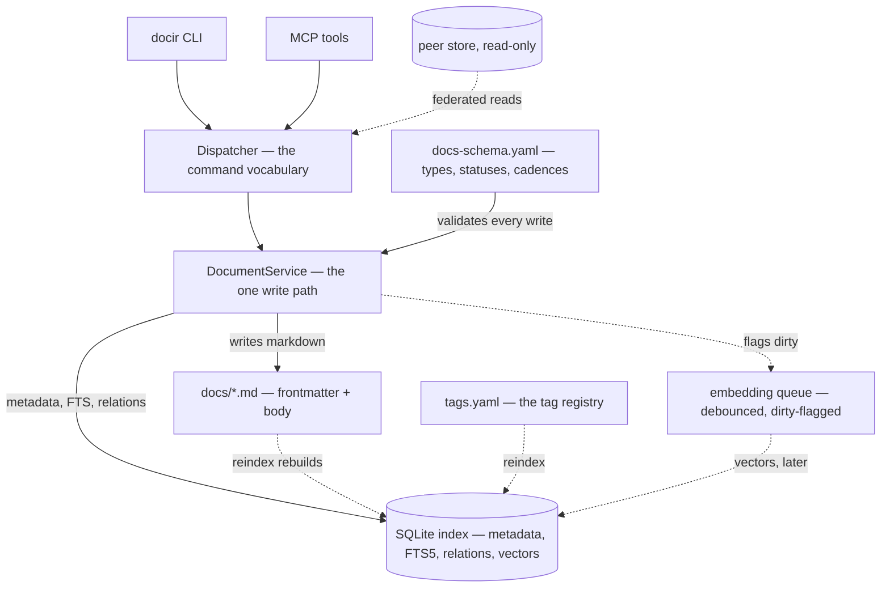

---
code:
- src/docir/**
created: '2026-07-30'
description: 'The shape of the system: git as the source of truth, the SQLite index
  as a derived projection, the layer map and the daemon — with each part of the pipeline
  in its own document.'
id: arch-1cfb1b212237
owner: maintainer
related:
- adr-599055502f0e
- arch-39314a23ba7f
- arch-0368cc754c15
- arch-03eeae8bf37d
- arch-ad342aae8293
- arch-7fd54a82f7d6
status: active
tags:
- architecture
- persistence
- retrieval
title: Doc-Index CLI — Architecture
type: architecture
updated: '2026-08-15'
---

## Principle

Git is the source of truth. The database is a derived, read-optimized index
built on top of the markdown files. No data lives uniquely in the database —
it can always be rebuilt from the files. AI agents never edit markdown files
directly; all writes go through the CLI to guarantee schema consistency.

## Diagram

The thesis in one picture: the files are the source, everything below them is a
compile artifact, and there is exactly one path that writes markdown.

Solid edges are synchronous and current when the command returns. Dashed edges are
the deferred or derived ones: a reindex makes the index agree with the files, the
embedding queue catches up afterwards, and a peer store is read but never written.

## Layers and responsibilities

| Layer | Responsible for | Not responsible for |
|---|---|---|
| Files (.md) | Content storage, git history, human readability | Fast search, structured queries |
| SQLite index | Search, filtering, relation graph, embeddings | Storing unique data |
| Daemon | Warm embedding model, async embed queue, request serialization | Being user-visible; holding canonical data |
| CLI | Agent contract, single write path, frontmatter consistency | Project business logic |

## Daemon process

The CLI remains a thin, stateless client from the user's/agent's perspective
(`docir <command> ...`), but underneath it delegates to a long-lived local
background worker instead of doing heavy work cold on every invocation.

### Why

the dominant cost of adding a semantic layer is not the embedding
computation itself but reloading the ONNX model into memory on every process
start — hundreds of milliseconds to over a second per call if done cold. A
persistent process keeps the model warm and serializes writes.

### Lifecycle

1. On first invocation of any command, the CLI checks for a running daemon: a
   pid file under `DOCIR_HOME` and a Unix socket. The socket is **not** under
   the home — a deep home path would blow past the platform's ~104-character
   `AF_UNIX` limit — so it is `<tmpdir>/docir-<sha1(home)[:12]>.sock`, short
   and stable per installation.
2. If not running, the CLI spawns it as a detached `python -m docir daemon
   serve`, waits for the socket, then proceeds. That entry point must keep
   working: it is how every cold start recovers.
3. Subsequent commands connect to the existing socket — no spawn, no model
   reload.
4. The daemon owns the SQLite connection and the loaded embedding model.
   Requests are serialized through one `SerializingExecutor`, which resolves
   write races without file locking.
5. The daemon is disposable: killed, missing, or answering on a stale socket,
   the CLI transparently respawns it. No command hard-fails because the daemon
   was not up.
6. An idle timeout (`DOCIR_IDLE_TIMEOUT`, 900s) keeps it from lingering as a
   forgotten background process.

### It also watches docs/

Hand-editing a file is permitted, and the window
between an edit and a `docir reindex` was one where every read answered from a
stale index with nothing saying so. Automating it is safe only because the files
are canonical: reindex writes no markdown, so it can only make the index agree
with them — which is why it defaults on (`DOCIR_WATCH=0` opts out) rather than
being a flag. Two details are easy to undo by accident. The watcher and the
socket server share **one** executor, because the server serializes clients but
the watcher is a second writer and SQLite has one. And the watcher swallows
reindex failures on purpose: a half-written file is normal (editors save in two
steps) and the next batch fixes it, while an exception would end the thread
silently, leaving a daemon that looks healthy and has stopped watching.

### A daemon that does not match the installed code is replaced

It loads docir
once and lives on, so after an upgrade or an edit under `src/` it kept answering
from the old build — and a stale answer imitates a correct one. The pid file
records a stamp of the version plus the newest mtime across the package, and a
mismatch stops and respawns. The stamp a running daemon reports is the one it
*started with*, not what is on disk now.

### Reaching the socket and waiting for the reply are timed separately

, and only
one is retryable. The connect is bounded at 5s, because a local `AF_UNIX`
connect succeeds at once or not at all; the reply is bounded by
`DOCIR_REQUEST_TIMEOUT` (300s), because it only arrives after the work is done
and one request can be a whole reindex. One shared timeout meant every command
slower than 5s failed while the daemon completed it. The two failures are
different exceptions on purpose: a refused connect means the request never
landed, so it is respawned and resent; an unanswered reply is **never** resent,
because the daemon still has it — a blanket retry killed it mid-transaction and
ran the command twice, which for a create meant a second document.

This keeps the "just run `docir ...`" UX simple — the daemon is an
implementation detail, never something to manage manually (though `docir daemon
status` / `docir daemon stop` are useful escape hatches), and `docir
--no-daemon` runs any command in-process.

## Where the detail lives

This document is the shape — the principle, the layer map and the daemon. Each
part of the system is now a document of its own, so a reader lands on the one
that answers them instead of scrolling a single file.

- `arch-39314a23ba7f` — the file format on disk: frontmatter fields, the tag registry.
- `arch-0368cc754c15` — the write path: id allocation, validation, the index update, diverged files.
- `arch-03eeae8bf37d` — the read path: ranking and fusion, section embeddings, visibility, peer stores.
- `arch-ad342aae8293` — validation strictness tiers, and schema drift against the index build.
- `arch-7fd54a82f7d6` — the CLI surface, the site build, and a worked end-to-end flow.
